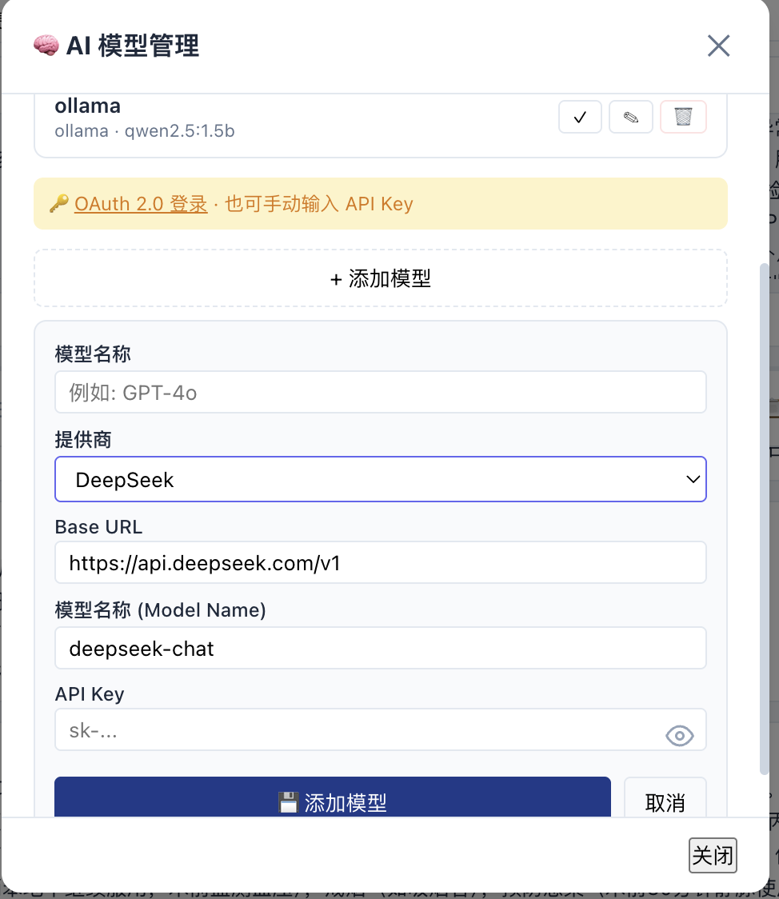

# 电子病历系统 v2 — 本地部署版

AI 驱动的电子病历系统，支持 **13 种病历文书**（分 3 大类）、多模型 AI 接入、本地数据库持久化、可视化提示词编辑，可完全离线运行。

---

## 界面预览





---

## 一、功能特性

### 1. 病历类型 — 3 大类 13 种

| 分类 | 类型 | 字段数 |
|:----|:----|:------:|
| **临床医师病历** | 首次病程录、主治查房、主任查房、术前小结、术前讨论、手术记录、出院小结 | 5-9 |
| **同意书** | 手术同意书、输血同意书、麻醉同意书 | 6-7 |
| **护理记录** | 护理评估、护理计划、护理记录单 | 6-8 |

所有类型通过 **类型注册表（Registry）** 统一管理，支持动态启用/禁用/排序。

### 2. AI 模型接入

- **多模型支持**：OpenAI / Claude / Gemini / DeepSeek / Ollama（本地）
- **后端安全代理**：API Key 仅存储在服务器端 `.env` 文件中，不暴露在前端
- **前端配置**：支持通过界面临时配置模型（存储在 localStorage，仅限本地开发）
- **离线模式**：内置模拟数据（`ai-mock.js`），无需 API Key 即可体验全部功能

### 3. 智能生成

- 通过 AI 对话或自然语言描述自动生成结构化病历
- **一次请求**返回结构化 JSON 输出，大幅提升生成速度
- **SSE 流式输出**逐字渲染，提升交互体验
- 对话系统支持**步骤化提示词**（4 步流程 + 最小改动原则 + 字段联动规则）
- 对话返回的 JSON 代码块可自动合并到病历中

### 4. 提示词系统

- **可视化编辑器**：访问 `/prompts` 编辑 AI 生成提示词
- **双层结构**：默认模板（只读，版本受控）+ 自定义模板（自由编辑）
- **字段级配置**：每个病历字段可独立编辑 label 和 description
- **活动模板管理**：通过 SQLite settings 表切换当前使用的模板
- **重构优化**：提示词模板从 API 路由中抽离为独立 JSON，支持版本合并与同步

### 5. 病历类型管理器

- 访问 `/record-types` 打开类型配置页面
- 三栏界面：分类管理 → 类型管理 → 字段配置
- 支持动态启用/禁用病历类型、调整排序
- 所有类型定义源于注册表（`src/data/recordRegistry.js`），是唯一真实来源

### 6. 患者管理

- Excel 风格的患者列表界面
- 支持搜索、排序、分页
- 完整的患者 CRUD 操作（创建、读取、更新、删除）

### 7. 数据存储

- **SQLite 后端持久化**：`data/emr-local.db`，含 `patients` + `records` 表
- 前端通过后端 API 读写数据，无本地浏览器缓存

---

## 二、项目架构

```
emr-local-v2/
├── AGENTS.md                      # 项目规则与开发约定
├── server.js                      # Express 服务器入口
├── package.json                   # 依赖配置
├── .env                           # 环境变量 (API Keys)
├── .env.example                   # 环境变量模板
├── src/
│   ├── routes/
│   │   ├── api.js                 # AI 生成 + 模板查询 + 对话
│   │   ├── crud.js                # 患者/病历 CRUD
│   │   ├── prompts.js             # 提示词模板管理 API（11 个端点）
│   │   └── recordTypes.js         # 类型注册表 REST API（9 个端点）
│   ├── services/
│   │   ├── ai.js                  # AI 服务层（多模型支持）
│   │   ├── ai-mock.js             # 离线模拟服务
│   │   ├── database.js            # SQLite 数据库服务
│   │   ├── promptTemplates.js     # 提示词模板管理（加载/合并/同步）
│   │   └── recordRegistry.js      # 类型注册表服务层（验证/存储/查询）
│   ├── data/
│   │   ├── templates.js           # 预置病历模板（40+ 种疾病）
│   │   ├── defaultPrompts.json    # 默认提示词（只读，版本受控）
│   │   └── recordRegistry.js      # 默认类型注册表常量（3 分类 13 类型）
│   └── middleware/
│       └── rateLimit.js           # 速率限制中间件
├── public/
│   ├── index.html                 # 主页面
│   ├── prompts.html               # 提示词编辑器页面
│   ├── record-types.html          # 病历类型配置页面
│   ├── css/
│   │   └── style.css              # 设计系统 + 响应式 + 打印样式
│   ├── screenshots/               # 界面截图
│   └── js/
│       ├── app.js                 # 应用入口 & 全局初始化
│       ├── store.js               # 可观察状态管理 + registry 辅助方法
│       ├── db.js                  # 后端 API 客户端
│       ├── services/
│       │   ├── api.js             # 后端 API 客户端
│       │   └── recordTypeApi.js   # 类型注册表 API 客户端
│       ├── data/
│       │   └── diseases.js        # 疾病目录数据
│       └── components/
│           ├── EmrPreview.js      # 病历预览 / 编辑 / 保存
│           ├── ChatArea.js        # AI 对话区
│           ├── DiseaseTree.js     # 左侧疾病树
│           ├── PatientManager.js  # 患者管理
│           ├── SettingsPanel.js   # 模型管理弹窗
│           ├── RecordTypeManager.js# 病历类型配置器
│           └── PromptEditor.js    # 提示词编辑器
├── data/
│   ├── emr-local.db               # SQLite 数据库文件
│   └── prompt-templates/          # 自定义提示词模板（不被 Git 追踪）
├── old/                           # 旧版本 README 存档
├── summarize log/                 # 开发日志与计划
└── README.md
```

---

## 三、类型注册表系统

**核心思路**：所有病历类型通过注册表统一管理，渲染/AI/模拟逻辑均从注册表派生。

```
src/data/recordRegistry.js（常量定义）
       ↓
src/services/recordRegistry.js（服务层：验证/存储/查询）
       ↓
src/routes/recordTypes.js（REST API：9 个端点）
       ↓
public/js/components/RecordTypeManager.js（前端三栏配置器）
       ↓
public/js/services/recordTypeApi.js（前端 API 客户端）
```

- **分类管理**：CRUD、启用/禁用、排序
- **类型管理**：CRUD、启用/禁用、排序、字段配置
- **前端派生**：store 中的 `getTypeConfig()` / `getActiveTypeData()` / `setTypeData()` / `setActiveType()` 等辅助方法从注册表动态生成标签页和字段渲染

---

## 四、提示词模板系统

**核心思路**：提示词从硬编码抽离为独立的 JSON 模板，支持版本管理和可视化编辑。

```
src/data/defaultPrompts.json（默认模板，只读，版本受控）
       ↓
src/services/promptTemplates.js（服务层：加载/合并/同步/组装）
       ↓
src/routes/prompts.js（REST API：11 个端点）
       ↓
public/js/components/PromptEditor.js（前端可视化编辑器）
```

**模板结构**（每个病历类型）：
- `rolePrompt` — 角色设定
- `outputFormat` — 输出格式要求
- `fields` — 字段列表（key / label / description）
- `endingPrompt` — 结尾要求
- `userPrompt` — 用户提示词模板（含 `{{disease}}`、`{{patientContext}}` 占位符）

**合并算法**：
- 自定义模板仅存储与默认模板不同的字段
- 生成时合并：默认字段顺序 + 自定义覆盖值
- 默认模板更新时：检测版本差异 → 查看差异 / 自动合并 / 忽略

---

## 五、已规划待实现功能

### P0 — RAG 知识库系统
- `src/services/knowledge.js` 按疾病读取 MD 文件注入提示词
- `src/data/medical-files/` 按疾病分类存放专业医学文件
- 前端文件上传管理界面

### P2 — 智能模板进化系统
- ≥3 份病例自动触发 AI 聚合分析
- 生成聚合模板，支持版本管理与回退

### P2 — 小模型+RAG 分级策略
- 有知识库的疾病 → 小模型（Ollama 本地）
- 无知识库的疾病 → 回退大模型

### P3 — 进一步完善
- TTS 语音实时输入
- 移动端接入（微信、QQ 等）

> 详细计划见 `summarize log/开发计划书-20260614.md`

---

## 六、优化亮点（v1 → v2）

| 优化维度 | v1 现状 | v2 改进 |
|---------|--------|---------|
| **项目结构** | 单文件 server.js (400+ 行) | 模块化目录，职责分离 |
| **安全性** | API Key 暴露在前端 localStorage | **后端代理**，API Key 配置在 `.env` |
| **AI 调用** | 7 次独立请求 (≈ 21s) | **1 次请求 + JSON 结构化输出** (≈ 3s) |
| **响应方式** | 全部完成后一次性显示 | **SSE 流式输出**，逐字渲染 |
| **数据持久化** | 刷新丢失 | **SQLite** 持久化存储 |
| **病历类型** | 1 种 | **13 种**（3 大类，注册表管理） |
| **类型管理** | 硬编码 | **注册表驱动**，动态启用/禁用/排序 |
| **提示词管理** | 硬编码在 api.js 中 | **独立 JSON 模板** + 可视化编辑器 + 自定义模板 + 版本合并 |
| **AI 模型** | 仅 OpenAI | OpenAI / Claude / Gemini / DeepSeek / Ollama |
| **离线支持** | 无 | **Mock 模式** + Ollama 本地模型 |
| **UI 体验** | 基础样式 | 设计系统 (CSS variables)、动画、骨架屏 |
| **布局** | 固定宽高 | **可拖拽分隔条**、响应式适配 |
| **导出** | 无 | **PDF 打印** 样式 |
| **键盘导航** | 无 | Ctrl+B(侧栏)、Ctrl+M(模型)、Enter(发送) |
| **错误处理** | 无 | Toast 通知、错误边界、加载状态 |
| **后端限流** | 无 | 内存速率限制 |
| **开发体验** | 手动重启 | `node --watch` 热重载 |

---

## 七、快速开始

### 1. 安装 Node.js

本项目需要 **Node.js 18+**（附带 npm）。如果你还没有安装：

- **Windows / macOS**：从 https://nodejs.org 下载 LTS 版本，双击安装即可。
- **macOS（推荐 nvm）**：
  ```bash
  # 安装 nvm（Node 版本管理器）
  curl -o- https://raw.githubusercontent.com/nvm-sh/nvm/v0.40.1/install.sh | bash
  # 重启终端后执行
  nvm install 18
  nvm use 18
  ```
- **Linux**：
  ```bash
  # 推荐使用 nvm（同上），或通过包管理器安装
  sudo apt install nodejs npm   # Debian/Ubuntu
  ```

**验证安装成功**：
```bash
node -v   # 应显示 v18.x.x 或更高
npm -v    # 应显示 9.x.x 或更高
```

### 2. 下载项目

```bash
git clone <仓库地址>
cd emr-local-v2
```

> 如果没有安装 Git，也可以在 GitHub 页面点击 **Code → Download ZIP**，解压后在终端进入该目录。

### 3. 安装依赖

```bash
npm install
```

> 如遇 `better-sqlite3` 编译错误：
> - macOS：`xcode-select --install`
> - Linux：`sudo apt install build-essential`
> - Windows：安装 Visual Studio Build Tools（勾选 C++ 桌面开发）

### 4. 启动

```bash
npm run dev
# 或生产模式：npm start
```

启动成功后终端会显示 `Server is running on http://localhost:8000`。

> 首次运行会自动创建 `data/` 目录和 `data/emr-local.db` 数据库文件，无需手动配置。

### 5. 打开浏览器

访问 http://localhost:8000

> 可选：配置 AI 模型后使用真实生成，不配置则自动进入离线模拟模式。
> 如需配置，请先执行 `cp .env.example .env`，再填入你的 API Key。详见 [八、API 密钥配置](#八api-密钥配置)。

---

## 常见问题

**端口被占用**（`EADDRINUSE` 错误）：
```bash
# macOS / Linux
lsof -ti:8000 | xargs kill -9

# Windows
netstat -ano | findstr :8000    # 找到 PID
taskkill /PID <PID> /F          # 杀掉进程
```
或在 `.env` 中修改端口号：`PORT=8001`

---

## 八、API 密钥配置

### 方式一：后端 .env（推荐，安全）
```env
OPENAI_API_KEY=sk-...
CLAUDE_API_KEY=sk-ant-...
GEMINI_API_KEY=...
DEEPSEEK_API_KEY=...
```

### 方式二：前端界面
点击顶部 **🧠 模型** 按钮，在弹窗中添加/管理模型配置。
（API Key 存储在 localStorage，仅限本地开发）

> 💡 两种方式都未配置时，系统使用**模拟模式**生成示例病历数据，无需 API Key 即可体验全部功能。

---

## 九、功能快捷键

| 快捷键 | 功能 |
|--------|------|
| `Ctrl+B` | 切换侧栏 |
| `Ctrl+M` | 打开模型管理 |
| `Enter` | 发送聊天消息 |
| `Ctrl+P` | 打印 / 导出 PDF |
| `Escape` | 关闭弹窗 |

---

## 十、技术栈

- **后端**：Node.js + Express (CommonJS)
- **前端**：Vanilla JS (ES Modules) + CSS Custom Properties
- **数据库**：SQLite（better-sqlite3）
- **AI 提供商**：OpenAI / Claude / Gemini / DeepSeek / Ollama
- **流式输出**：Server-Sent Events (SSE)
- **Node 版本要求**：18+（安装：https://nodejs.org 或 nvm install 18）

---

## 十一、关键设计决策

| 决策 | 选择 | 理由 |
|------|------|------|
| 数据库 | SQLite + JSON 列 | 轻量、单机部署、灵活扩展 |
| 病历类型管理 | 注册表驱动 | 动态配置、单一真实来源 |
| 提示词管理 | 独立 JSON + 合并算法 | 可版本控制、可自定义、可恢复默认 |
| 离线方案 | Mock + Ollama | 无需网络、本地运行 |
| 知识库格式 | MD 文件按疾病分类 | 简单、易维护、版本控制友好 |
| 模型策略 | 分级（小模型+知识库 / 大模型） | 成本与效果平衡 |
